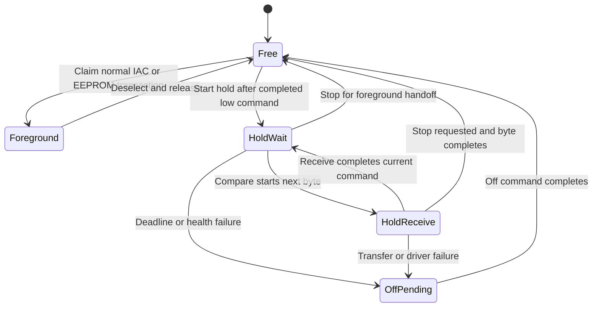

# Stepper and fan sequencing

The supplied Citroen training document, PDF p.43 (technical p.37), identifies
the M7.4.4 stepper as the bypass-air actuator for starting, idle loads and return
to idle. PDF p.12 describes load compensation including the fan. Those are
functional expectations, not proof of a particular phase polarity or current.

## Stepper direction and reference

The original standalone `IAC.C`, `iacDoScheduledStep`, closes the valve by
advancing through `12,13,1B,1A` and opens it by traversing that table backward.
Its comments identify that direction as tested on the vehicle. The rewrite
preserves this supplied evidence; no conflicting OEM polarity was established
in this change. It does not present those comments as a new ROM proof.

The previous development implementation had inverted this traversal. Homing
and ordinary closing now share the forward direction. Opening uses reverse.
Position remains the last command estimate during homing and becomes zero only
after all homing phases have completed their drive/response interval. The phase
count is calibration word `0x93C` (0 = 250). It must be at least the IAC maximum
position (`0x910`), at most 800, and fit the home timeout (`0x91C`) at 12 ms per step.
Timeout and faults invalidate the reference through the actuator state. An
unreferenced position number must not be displayed as a valid physical position.

## Driver status and bridge-off failure

ST's [L9935 datasheet, sections 5.10-5.13](https://www.st.com/resource/en/datasheet/l9935.pdf)
describes open-load limitations at low current and possible startup indications
for up to eight polarity changes. Its diagnostic table distinguishes the
combined open/short-to-supply indication, short-to-ground indication and thermal
pre-alarm. Low-current status is not proof of a healthy load.

The standalone driver associates each returned status with its preceding
command. It counts consecutive open/short-to-supply indications only after
drive phases, retaining the count through low-current hold transfers. Nine
qualified indications latch fault 2. A healthy qualified drive response resets
that count. Short-to-ground and thermal indications latch faults immediately
after either active-current command. An off-command echo does not qualify a
diagnostic sample. This is driver protection policy, **not an OEM DTC producer**.

| Internal fault | Meaning |
|---|---|
| 1 | Command transfer failed |
| 2 | Persistent qualified open/short-to-supply indication |
| 3 | Short-to-ground indication |
| 4 | Thermal indication |
| 5 | Homing elapsed-time limit |
| 6 | Requested bridge-off transfer failed |
| 7 | Hold deadline/admission or controller-health failure |

The first cause and fault count remain latched. Failed bridge-off transfers set
`off_pending`; the foreground retries at a bounded cadence without resuming
motion or erasing the fault. Storage service is denied while bridge-off remains
pending. A successful transfer proves that the command was sent, not measured
zero winding current. SSC failure and reset behavior still require board tests.
For a hold fault, the response present when its first cause latched is retained
and copied to the IAC monitor; subsequent off-command replies cannot erase it.

## Timed hold and SSC ownership

`iac_hold.c` alternates the original standalone's high/low current commands on
the same electrical phase. Its nominal latched-command intervals are 460/790
T7 ticks, or 368/632 microseconds at the inherited 20 MHz clock and /16 timer.
The arithmetic weighted command setting is about 240 mA. Actual winding current
and holding torque require measurement on the fitted motor/driver.

The [C167 manual, section 11.3](https://community.infineon.com/gfawx74859/attachments/gfawx74859/twlegacymcu/1131/1/2594108.pdf)
specifies `fCPU / (2 * (SSCBR + 1))` for SSC baud rate. With SSCBR=128, eight bits
take 129 T7 ticks. The compare launches each transfer that much before the next
nominal command edge. Completion raises chip select and anchors the following
interval. Interrupt and software latency remain physical acceptance items.

The board SSC module serializes every owner transition. A hold session reserves
the bus during both its wait and in-flight byte. CC22 starts a byte; SSC receive
completes it. Neither interrupt polls. T6, CC22 and SSC receive share ILVL10,
with distinct groups, so these owner handlers cannot preempt one another.
Crank and ignition interrupts retain higher priority. Short critical sections
also protect foreground handoff and the shared CCM5 register fields.

EEPROM transactions are rejected while the bus is reserved. Normal IAC motion
stops hold and drains any active byte before selecting a new frame; this wait
is bounded and occurs only in foreground. Deadline expiry, failed reception
and SSC receive/phase/transmit/baud error flags stop modulation and retain the
first fault. A timed-out frame is deselected before off is retried. A busy
peripheral keeps ownership reserved until it can accept off. A stuck peripheral
cannot be forced electrically inactive through a software command alone.

The health tick supervises holds and ordinary drive phases, so a foreground
stall does not require foreground code to request off. It also uses the
independent T1-derived millisecond clock to detect a T7 counter that has stopped
for at least two milliseconds. A stopped counter during reception aborts the
frame and reserves the bus until an off transfer can complete. Reset startup sends off
before EEPROM loading and skips loading if that transfer fails. Boot/reset and
hardware-trap behavior still require measurements with the externally powered
driver; a CPU reset is not assumed to reset that driver.

Late-launch tolerance is 250 T7 ticks and receive timeout is 625 ticks. These
are standalone protection limits pending worst-case timing measurements. Same-
phase modulation does not count additional open-load observations; thermal and
short-to-ground indications are still acted on. This protection state machine
does not claim to implement the OEM stepper DTC producer.

## Fan preload

Temperature hysteresis produces a fan request separately from the relay state.
The request contributes the tunable idle feedforward before relay admission.
With a referenced stepper during idle/start catch, the controller latches the
requested preload position and waits for command accounting to reach it with
no pending step. This is not a measured position sensor.

While waiting, the air target stays at least at that preload, subject to the
configured travel limit, and idle integration does not remove the pending
load compensation. Mode/gain reseeding preserves the change in feedforward.
Relay admission follows arrival or a 500 ms elapsed-time limit. Unavailable
stepper control, invalid coolant input, stopped engine, service mode or no
configured preload bypasses the wait. Cooling demand therefore cannot be held
off indefinitely by a failed motor. Cancellation removes the pending request;
the original temperature hysteresis continues to govern demand.

Native C tests cover phase direction, response-qualified accounting, timeout
without fabricated reference, consecutive diagnostic indications through hold,
bridge-off failure/retry/service admission, fan arrival, cancellation, faults,
live controller reseeding, travel saturation and time wrap. Physical torque,
current, valve motion and the resulting engine-speed dip remain unmeasured.
`test_ssc.c` additionally compiles the actual board owner with register
substitutes and checks all four phase polarities over retained waveforms, timer
wrap, EEPROM exclusion, mid-byte handoff, stalled receive, phase errors and
health/service shutdown. `test_iac_hold.py --target` compares the hold-state
boundaries with the actual Keil-linked code. Neither harness measures ISR
latency or electrical waveforms.
