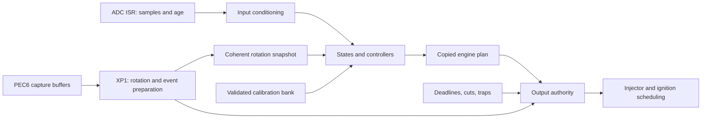

# Architecture and evidence

## Ownership

`rotation.c` owns accepted crank-edge history in the deferred XP1 worker. PEC6
buffers CC15 timestamps; the capture ISR rearms and publishes completed blocks.
Foreground copies rotation state with interrupts masked. A 60-2
decoder must see consistent gaps before publishing valid rotation. Loss of
validity revokes output authority immediately.

Invalid TPS, coolant, IAT, battery and speed-density MAP observations record
[standalone DTCs](FAULTS.md) instead of an engine inhibit. They retain their
invalid quality while calculations use the latest captured raw reading through
the calibration conversion; stale acquisition does not invent a new reading.
Calibration validity remains mandatory. The private fault journal is independent
of the native diagnostic producer/parity work.

The foreground runs one ordered control pass on a 10 ms release: input
conditioning, engine state, fan demand/idle, limit policy, AE, fuel/ignition
computation, atomic inhibit evaluation and plan publication, auxiliary output.
It never reads a partially edited calibration. The tick interrupt supervises
foreground and plan age. Its elapsed time comes from T1; coalesced tick service
does not simply count as one elapsed millisecond. Missed service above the
implemented threshold latches a deadline fault. Validate the threshold against
measured worst-case execution time before release.

Only the output authority admits injector/coil starts. Admission checks the
current inhibit mask, rotation validity, epoch, cut policy and plan age inside
a critical section. Fuel cuts cancel active injection. Spark cuts and recoverable
revocation cancel future charges and drain an existing charge at its retained
fire deadline; loss of angle converts a coarse stage to its predicted time.
Output/board faults and traps retain immediate electrical safing. An armed coil event pins
its dwell and authority epoch. Live calibration readers are foreground-only;
interrupts use copied plans. Shared members are volatile, but snapshots and
publication still require exclusion; volatile does not provide atomicity.

ADC publication retains the full conversion word as well as the count used by
tunable controls. Native diagnostic conversion uses this separate representation.
The per-channel raw word, timestamp and validity metadata are copied together
under short exclusion. Age uses the clock captured with that read, advanced
from the control-release timestamp when needed; a conversion arriving during
the pass therefore cannot underflow its age and appear stale. This comparison
assumes the release and sample clocks belong to the same uptime, as they do in
the running firmware. ADC and VSS interrupt handlers also exclude the higher-
priority tick while copying the 32-bit clock. The tick's clock write is already
inside its own critical section. The Keil ISR tests exercise every instruction
boundary at low-word and full-clock rollover, with negative controls that
remove the read exclusion in a temporary emulator image.

SSC has one serialized owner. Hold modulation reserves it across compare-start
and receive-completion interrupts; foreground drains that session before normal
IAC commands, and EEPROM traffic is rejected while it is reserved. EEPROM writes
are short state-machine steps. Stepper movement accounts for a phase only after
its returned driver status has been checked. Homing timeout means fault, never
successful homing.
Position is commanded position; there is no position sensor.
Failed bridge-off requests remain pending and are retried; they block storage
service admission. Fan request and relay state are separate so idle feedforward
can precede relay closure. See [ACTUATORS.md](ACTUATORS.md) for direction,
diagnostic sampling, bounded preload waiting and hold-current timing/acceptance.

Calibration and diagnostic-history journals also hold a foreground EEPROM lease
across all write/verify phases, independently of individual SSC transfers.
The history persistence owner tracks changes and clears arriving after its
immutable snapshot; an older save cannot mark newer work persisted. Standalone
boot/shutdown now own it; complete native diagnostic input binding remains open. See
[HISTORY.md](HISTORY.md) for the mutation and completion contract.

## Timer and interrupt contract

At the inherited **20 MHz assumption**, T1/T7 at /16 have 0.8 us ticks. Pulse
conversion is `ceil(us * 5 / 4)`. T7 compare horizons stay below half a timer
wrap; injection is capped at 25 ms. T1 overflow extends captured time.

| Source | Priority level / group | Purpose |
|---|---|---|
| CC15, T1 overflow | 15/2, 15/3 | PEC6 crank capture completion and timestamp extension |
| CC20, CC21 | 14/0, 14/1 | Independent coil-on deadline interrupts |
| CC0, CC1 | 13/3, 13/2 | Staged angular firing (CC0IO = P2.0 coil A, CC1IO = P2.1 coil B) |
| CC6, CC4 | 13/1, 13/0 | Staged charge starts |
| CC30, CC29, CC28, CC23 | 12/3, 12/2, 12/1, 12/0 | Injector start/end |
| UART RX | 11/0 | K-line; a returned echo launches the next reply byte |
| T6 | 10/0 | Nominal 1 ms health/release service; starts an ADC scan every 5 ms |
| SSC RX, CC22 | 10/1, 10/2 | Hold transfer completion and next-current launch |
| XP1 | 9/2 | Capture decoding and event preparation |
| CC9, CC8 | 9/1, 9/0 | Dwell feedback and DEPHIA capture |
| ADC | 8/0 | Input publication (one 16-channel single auto-scan per 5 ms) |
| CC19, T5, CC27 | 6/0, 6/1, 6/2 | Boost PWM, gauge end, tach end |
| CC14 | 5/0 | VSS capture |

`hal_lock` raises PSW.ILVL to 14 rather than clearing IEN. Crank capture and
the T1 extension (level 15) therefore run through every ordinary critical
section; the few places that share state with them (capture snapshot, the
XP1 work queue, capture timeout, the tick/phase clock copies and the flash
worker) use `hal_hard_lock` (IEN = 0) for a handful of instructions. OEM
image evidence informed this layout: its CC15 handler at 0x2B0B6 keeps only
the last two captures of each 30-word PEC block and leaves decoding to later
code, with a T0 hardware tooth count.

The final fire stage uses compare mode 1 (toggle on match) on CC0/CC1, so the
spark edge is set by hardware at the compare instant instead of by the ISR;
the ISR only records completion. In the Keil simulation this reduced spark
edge jitter at 9,950 rpm from up to 110 us to ±0.2 us. Mode 3 is unusable
here: it allows one match per timer period and clears the pin on overflow.

XP1 runs below T6 since 23 September 2026. Before the block decoder a
30-tooth block took up to ~2.5 ms at the programmed bus timing (Keil
simulation, BUSCON0=04AE); above T6 it delayed the tick past the 3 ms DEADLINE
bound. The block decoder takes about 1 ms at 10,000 rpm. UART RX sits above
T6 because ASC0 keeps a single received byte (0.5 ms at 19,531 baud); the wire
itself limits it to one short interrupt per byte time. The ADC formerly
scanned continuously with one interrupt per conversion (17-24k/s, about a
third of the CPU); control consumes one filtered sample per channel per
10 ms, and CAL_SENSOR_AGE still bounds staleness.

Gauge is a 100 Hz T5 one-shot; boost uses the inherited T8 period of 4610
ticks at /128, approximately 33.9 Hz. Tach has a software-controlled 3 ms end
compare: CC27 has no dedicated hardware output pin on C167. Hardware injector
compare and software safing must both be checked on the actual MCU derivative.
All running port writes use bit addressing to avoid restoring neighbouring
actuator bits. Disabling interrupts alone would not prevent a concurrent
hardware compare from changing a port latch.

The user stack is 2048 bytes and the linked system stack is 1024 bytes
(STK_SIZE=4, 512 words; the startup's SSTSZ setting is inactive). These are linker
reservations, not measured proof of adequate stack depth. Flash code and C
initialization tables are restricted below 0x70000. No runtime flash writer or
opaque external update blob is included.

## Engine-output scheduling

`target/c167/capture.c` owns PEC6 buffers and their XP1 consumer.
`target/c167/engine_outputs.c` owns staged ignition descriptors, CC9 feedback,
future injector compares and cancellation. `src/oem_timing.c` contains the
ROM-derived timing arithmetic. See [OEM-SCHEDULER.md](OEM-SCHEDULER.md) for
image evidence, implemented behavior, standalone adaptations and validation.

The capture ISR no longer decodes every tooth and schedules all outputs.
Normal firing uses a T0 counter stage followed by a T1 time stage. Charge starts
and completed feedback have separate storage from active firing descriptors.
The nominal minimum dwell is checked at admission; ISR latency does not impose
another minimum remaining dwell. Starting mode has an explicit relative-time
adapter. Coarse expiry follows the scheduled tooth rather than a far-future time
estimate. After refinement, time expiry remains bounded. A first capture after
storage loading seeds acquisition from the current counter; exactly one newer
pending edge belongs to the following PEC buffer. Counter/capture snapshots retry
if an electrical edge tears the read. Late stages are counted, and skip an
uncharged event or finish a charge against its retained deadline.

Missing or invalid CC9 never increases dwell. Calibration byte 0x93A enables
qualified feedback; zero uses calibrated dwell. Command 0x2E exposes per-coil
missing/invalid counts, correction, draining state and late-event count. These
are volatile observations, not evidence that an analog spark occurred.

Watchdog service follows advancing clock and bounded foreground progress even
with deadline/output inhibits latched. Those latches still require reset to
rearm outputs, but do not themselves deliberately trigger a watchdog reset.

## Phase attribution without sequential injection

Cylinder phase is independent of the injection scheduling choice. The supplied
Citroen reference describes DEPHIA as a PHASE logic signal derived from the
different secondary breakdown voltages of cylinders 1 and 4: logic 1 identifies
cylinder 1 compression and logic 0 cylinder 4 compression (technical pp.24-25,
PDF pp.30-31). ROM evidence supplies the image-specific implementation: the
ignition path arms CC8, the CC8 ISR at `0x67DE8` captures its timing, and
`0x67B8C` publishes phase diagnostic events `0x1A/0x4B` (P1327).

The standalone now configures P2.8/CC8 for rising-edge T1 capture and arms it at
coil-A completion. It follows the ROM's calibrated acquisition shape: a capture
must lie between 66 and 168 ticks and successive captures must differ by at
least 18 ticks before phase becomes valid. Missing and invalid captures feed
events `0x1A/0x4B`; crank-sync loss invalidates attribution. The direction is
converted to cylinder-1/cylinder-4 identity through calibration byte `0x962`,
because the board/wiring polarity still requires a waveform acceptance test.
That identity labels the two 180-degree crank-acceleration windows used for
P0301..P0304. Paired injection remains unchanged; no injector output is made
sequential.

## Evidence boundaries

The supplied Citroen document `docs/ecu Bosch me7.4.4.pdf`, SHA-256
`7aa7ac81f2ece26f378930c02fd3d7db3a3092bcbbd340f56540b7fe7a57cd69`, is the functional
reference. PDF pp.39–40 describe upstream/downstream oxygen sensing and equipment
variants; pp.50–53 describe diagnostic/MIL context. These are supplied functional
evidence, not firmware-address or timing proof. M7.4.4 and ME7.4.4 equipment must
not be conflated.

The TU5JP ROM used for native comparisons has SHA-256
`5710015f7c5c066c860a1757fd893f305701608c25af8ff23bfcb4fd1e4837b3`. The pin inventory,
diagnostic table at file offset 0x16682, coolant region 0x68C4A–0x696D6 and MIL
region 0x6C1B0–0x6C3CA are image-specific. Exact source boundaries are in the
generated layout/matrix and tests. OEM evidence governs conflicting pin claims.

The [C167 manual](https://community.infineon.com/gfawx74859/attachments/gfawx74859/twlegacymcu/1131/1/2594108.pdf),
chapters 5, 10, 11 and 14, supplies interrupt, watchdog and timer semantics.
Measured clock, input conditioning, driver polarity/current and reset behavior
remain hardware evidence requirements.

No external watchdog has been established by this work. P3.5 is treated according
to the OEM knock self-test evidence, not repurposed as watchdog service or a
security-disable output. The new implementation services the C167 internal
watchdog. `provenance.json` records the original startup/register files before
local changes; their inherited bus configuration still needs board validation.
